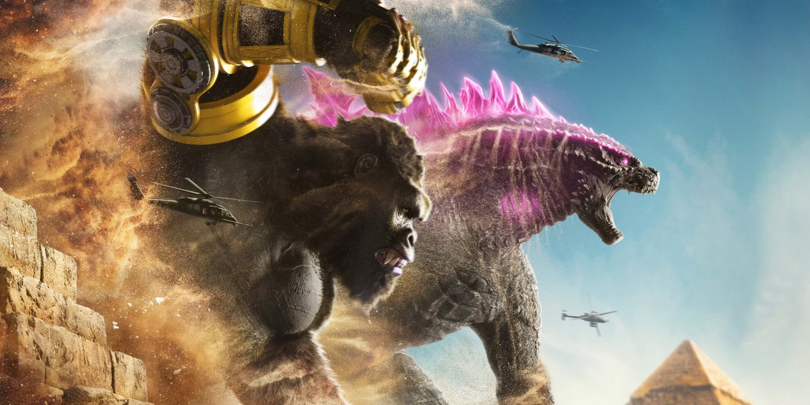

### Title: Godzilla vs. Kong Cheat Sheet

Synopsis:
Godzilla and Kong, two iconic titans, clash in a battle for supremacy, with humanity caught in the middle. As they embark on a dangerous journey to uncover the origins of the Titans, they encounter hidden mysteries and powerful adversaries.

Characters:
1. Godzilla - A colossal reptilian titan who defends the natural balance of the world.
2. Kong - A gigantic ape and protector of Skull Island, possessing intelligence and strength.
3. Madison Russell - A young girl who seeks to understand and communicate with the Titans.
4. Nathan Lind - A geologist who leads an expedition to find the source of the Titans' power.
5. Walter Simmons - CEO of Apex Cybernetics, with ambitions to harness the Titans' energy.
6. Jia - A young deaf girl with a special bond to Kong, serving as his caretaker.

Key Plot Points:
1. Godzilla's sudden attacks on human cities raise concerns about his motives.
2. Kong is discovered on Skull Island and forms a connection with Jia.
3. A journey to the Hollow Earth is undertaken to find a power source to stop Godzilla.
4. Mechagodzilla, a robotic Titan created by Apex Cybernetics, is unleashed.
5. Godzilla and Kong unite to defeat Mechagodzilla, restoring balance to the world.

Themes:
1. Nature vs. Technology: The clash between natural Titans and human-made creations.
2. Power and Control: The desire to harness the Titans' power for personal gain.
3. Friendship and Connection: The bonds formed between humans and Titans, particularly Kong and Jia.
4. Environmental Balance: The role of Titans in maintaining the ecological balance of the world.

Memorable Quotes:
1. "Kong bows to no one."
2. "There can't be two Alpha Titans."
3. "Godzilla's out there and he's hurting people, and we don't know why."
4. "We need Kong... The world needs him to stop what's coming."

Trivia:
- "Godzilla vs. Kong" is the fourth film in Legendary's MonsterVerse.
- The film features numerous Easter eggs and references to past Godzilla and Kong movies.
- The Hollow Earth theory, explored in the film, is a real speculative concept in science.
