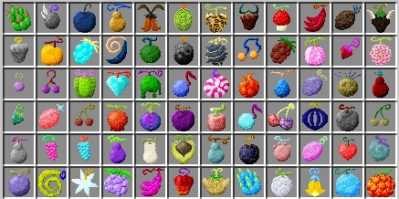

# Anime Series

## Story all About?
### "One Piece" is an epic tale of adventure, friendship, and the pursuit of dreams set in a vast world dominated by the sea. The story follows the journey of Monkey D. Luffy, a spirited young pirate with the ambitious goal of becoming the Pirate King by finding the legendary treasure known as One Piece. Alongside his diverse and loyal crew, the Straw Hat Pirates, Luffy sets sail across treacherous oceans, encountering rival pirates, formidable foes, and enigmatic islands teeming with both wonders and dangers. As they navigate the perils of the Grand Line and confront the oppressive forces of the World Government, the Straw Hats forge unbreakable bonds, defy impossible odds, and stand firm in their quest to chart their own destinies. Fueled by themes of freedom, justice, and camaraderie, "One Piece" captivates audiences with its vibrant characters, intricate world-building, and gripping storytelling, inspiring readers and viewers alike to embark on an unforgettable journey to discover the true meaning of adventure.

## Characters 
| Characters | Info |
|------------|------|
|Monkey D. Luffy| The protagonist and captain of the Straw Hat Pirates.|
|Roronoa Zoro | The swordsman with a three-sword style.|
|Nami| The navigator with exceptional map-making skills.|
|Usopp| The sharpshooter and skilled liar.|
|Sanji|The cook with powerful legs and mastery in martial arts.|
|Tony Tony Chopper| The doctor and a reindeer with a Devil Fruit ability.|
|Nico Robin| The archaeologist with the ability to sprout multiple body parts.|
|Franky| The shipwright and cyborg with a knack for inventions.|
|Brook| The musician and swordsman, a living skeleton with a Devil Fruit ability.|
|Jinbe| A fish-man and expert helmsman.|

## Devils Fruit

## In the anime and manga series "One Piece" created by Eiichiro Oda, there are a variety of Devil Fruits that grant their users unique powers and abilities. Here's a list of Devil Fruits categorized by their types:

## Paramecia: 
These Devil Fruits grant a wide range of abilities, often altering the user's body or manipulating their surroundings.
1. Gomu Gomu no Mi (Rubber-Rubber Fruit): Eaten by Monkey D. Luffy, granting him rubber-like properties and the ability to stretch his body.
2. Bara Bara no Mi (Chop-Chop Fruit): Eaten by Buggy the Clown, allowing him to separate his body into floating pieces.
3. Gura Gura no Mi (Tremor-Tremor Fruit): Eaten by Edward Newgate (Whitebeard), enabling him to create shockwaves and cause earthquakes.

## Zoan: Zoan-type 
### Devil Fruits allow users to transform into animals or mythical creatures, as well as hybrids of both human and animal forms.
1. Hito Hito no Mi (Human-Human Fruit): Eaten by Tony Tony Chopper, enabling him to transform into various human-animal hybrid forms.
2. Inu Inu no Mi, Model: Wolf (Dog-Dog Fruit, Wolf Model): Eaten by Jyabura, allowing him to transform into a wolf and a wolf-human hybrid.

## Logia: 
### Logia-type Devil Fruits grant the user the ability to transform into a natural element, control it, and become virtually intangible.
1. Mera Mera no Mi (Flame-Flame Fruit): Eaten by Portgas D. Ace, granting him the ability to create, control, and transform into fire.
2.  Goro Goro no Mi (Rumble-Rumble Fruit): Eaten by Enel, allowing him to transform into lightning and control electricity.

